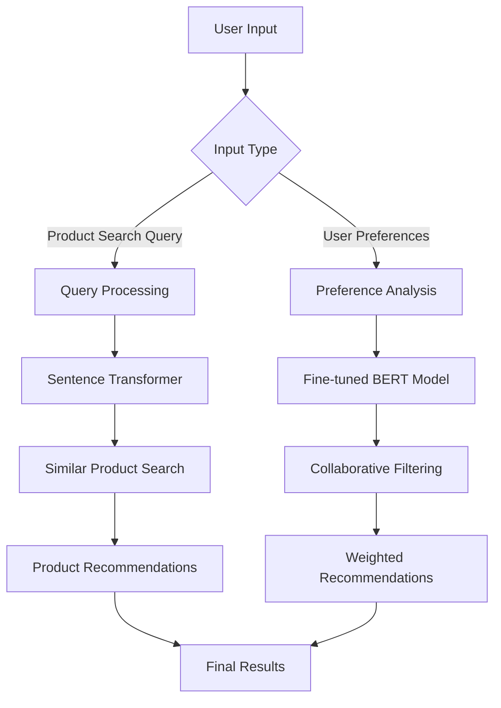

# Recommendo: Personalized Shopping Powered by LLMs

A sophisticated recommendation system that combines collaborative filtering, fine-tuned BERT models, and LangChain to provide personalized product recommendations based on user preferences and queries.

## 🔍 System Overview



## 🏗️ Architecture Components

1. **Query Processing System**
   - Uses Sentence Transformers for embedding generation
   - Implements semantic search capabilities
   - Processes natural language queries for product search

2. **Preference Analysis System**
   - Fine-tuned BERT model for understanding user preferences
   - Takes into account user likes/dislikes
   - Generates personalized recommendations

3. **Vector Storage & Retrieval**
   - FAISS vector store for efficient similarity search
   - Stores product embeddings for quick retrieval
   - Enables fast similarity matching

## 🛠️ Technical Stack

- **Core Technologies**
  - Python 3.11
  - LangChain
  - Sentence Transformers
  - BERT (Fine-tuned)
  - FAISS Vector Store

- **Key Libraries**
  - `langchain_core.embeddings`
  - `sentence_transformers`
  - `FAISS`
  - SQLAlchemy (for database operations)

## 💡 Features

1. **Product Search**
   - Natural language query processing
   - Semantic similarity matching
   - Returns products similar to user query
   
2. **Personalized Recommendations**
   - User preference-based filtering
   - Collaborative filtering with weighted values
   - Historical interaction analysis

3. **Hybrid Approach**
   - Combines content-based and collaborative filtering
   - Weighted recommendation system
   - Real-time query processing

## 🚀 Implementation Details

### Product Search Flow
1. User submits a product search query
2. Query is processed through Sentence Transformer
3. Vector embeddings are generated
4. Similar products are found using FAISS
5. Results are ranked and returned

### User Preference Based Recommendations
1. System retrieves user preferences and likes
2. Fine-tuned BERT model processes preferences
3. Collaborative filtering applies weighted values
4. Personalized recommendations are generated

## 📋 Usage Examples

```python
# Product Search Example
query = "Give me mobile devices like Redmi Note 12"
result = get_similar_product_from_query(query)
```


```python
# Product Search Example
query = "Give me best phones with minimum 8Gb ram, 128gb Rom and of samsung brand."
result = get_similar_product_from_query(query)
```


```python
# Product Search Example
query = "Give me mobile devices like Samsung Galaxy s10"
result = get_similar_product_from_query(query)
```


```python
# User Preference Based Recommendation
data={"user_id":100}
recommendations = get_recommendations(user_preferences)
```


```python
# User Preference Based Recommendation
data={"user_id":190}
recommendations = get_recommendations(user_preferences)
```

## ⚙️ Setup and Installation

1. Clone the repository
2. Install required dependencies:
   ```bash
   pip install langchain sentence-transformers faiss-cpu
   ```
3. Set up the vector store directory
4. Initialize the fine-tuned models

## 📈 Performance Metrics

The system evaluates recommendations based on:
- Semantic similarity scores
- User engagement rates
- Recommendation relevancy
- Query processing time

## 🔜 Future Improvements

1. Enhanced query understanding
2. More sophisticated weighting algorithms
3. Real-time user feedback incorporation
4. Extended product attribute analysis
5. Advanced personalization features

## 📚 References

- LangChain Documentation
- Sentence Transformers Documentation
- FAISS Documentation
- BERT Fine-tuning Guidelines

## 👥 Contributors

- Prabigya Pathak